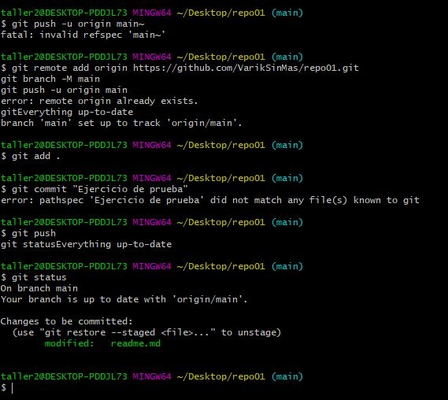

## **EJERCICIOS GIT :books: (ANTONI F.)**
### **REPERTORIOS LOCALES Y REMOTOS**
1. He creado un directorio local en el escritorio llamado "repo01" con [git init].
   
   

3. He creado desde VSC, 4 archivos con extensiones .html, .js, .css y .md (la última para documentar el procedimiento).
   * 1.1 Una vez creado, comprobamos con [git status] el estado de los archivos del directorio y los añadimos con [git add .]
   
4. Realizamos un commit con git commit -am "Creo los archivos"
   * 4.1 Logeo en github y creo un repositorio llamado "repo01" y lo asociamos con nuestro repositorio local comprobando previamente que estan correctos los datos de usuario y correo con [git log] y [git config --global user.name|email].

   * 4.2 Una vez asociados y comprobado que todo este bien, lanzamos un [git push] para refejar los cambios en el repositorio remoto.

### **CLONACIÓN DE REPERTORIOS**
1. Clonamos un repertorio a local partiendo de un url de un repertorio remoto que se nos ha facilitado.
   1.1 Con el comando [git clone <`url`>] .

2. Creo un archivo readme.md, guardamos los cambios con [git add .] y comprobamos con [git status]. Hacemos un commit con [git commit -am "Añado archivo readme.md]
   2.1 Subimos los cambios con [git push]

### **RESUMEN DE COMANDOS**  
  
  | COMANDO             |  UTILIDAD   | 
|-------------------|-------------|
| clear   | Limpiar consola    
| pwd        | Muestra ruta la ruta de trabajo       
| cd ..  | Bajar 1 posicion de directorio 
| cd + (directorio)          | Ir a un directorio concreto  
| mkdir + nuevo directorio   | Creación de nuevo directorio    
| git init        | Creación de repositorio local       
| git config --global user.name "nombre de usuario  | Usuario GitHub 
| git config --global user.email "correo"          | Email GitHub  |
| git rm --cached + "nombre del fichero"  | Eliminar fichero concreto    
| git add .       | Añadir modificaciones de ficheros en el directorio       
| git status  | Estado del repositorio local 
| git commit -m + "Mensaje de modificación"          | Transferir archivos del State Area a Repositorio local 
| git commit -am + "Mensaje de modificación"   | git commit -m + git add .  
| git log   | Historial de lo realizado   
| git fetch        | Recuperar ultima información del original      
| git push  | Subir los cambios a Repositorio Remoto
| git pull          | Refleja cambios en Repositorio Remoto para extraer y descargar archivos  
| git clone   | Conación de un repositorio   
